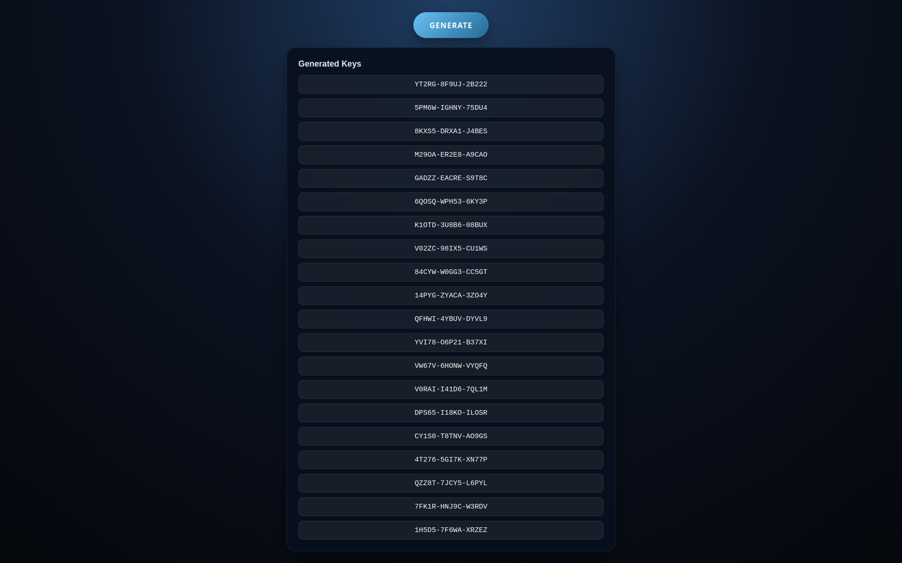

# Keygen

This is a simple web application that generates 20 unique keys when a button is clicked. 
This toll was created to help people who need unique keys for making own games and other thing.
The application is built using Flask and features a clean user interface.

## Project Structure

```
my-web-app
├── app.py               # Main entry point of the web application
├── keygen3.py           # Contains the key generation logic
├── templates
│   └── index.html       # HTML structure of the web application
├── static
│   ├── css
│   │   └── styles.css    # CSS styles for the web application
│   └── js
│       └── app.js        # JavaScript code for handling button click events
├── requirements.txt      # Lists the dependencies required for the project
└── README.md             # Documentation for the project
```

## Setup Instructions

1. **Clone the repository**:
   ```
   git clone https://github.com/nicolashanusic280326/Keygen.git
   cd Keygen
   ```

2. **Install dependencies**:
   Make sure you have Python, pip and venv (in case of error) installed. Then run:
   ```
   pip install -r requirements.txt
   ```

   In case there is an error installing requirements run:
    ```
    python3 -m venv venv
    source venv/bin/activate
    ```
    And than after you created python virtual enviroment try and install requirements again.

4. **Run the application**:
   Start the Flask server by executing:
   ```
   python app.py
   ```

5. **Access the application**:
   Open your web browser and go to `http://127.0.0.1:5000` to view the application.

#Preview


## Functionality

- The application features a single button labeled "Generate."
- When clicked, the button triggers the key generation logic, producing 20 unique keys.
- The generated keys can be displayed on the web page for user reference.

## License

This project is licensed under the MIT License - see the LICENSE file for details.
